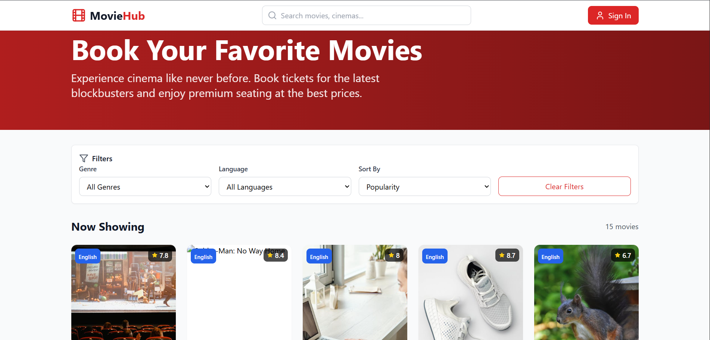
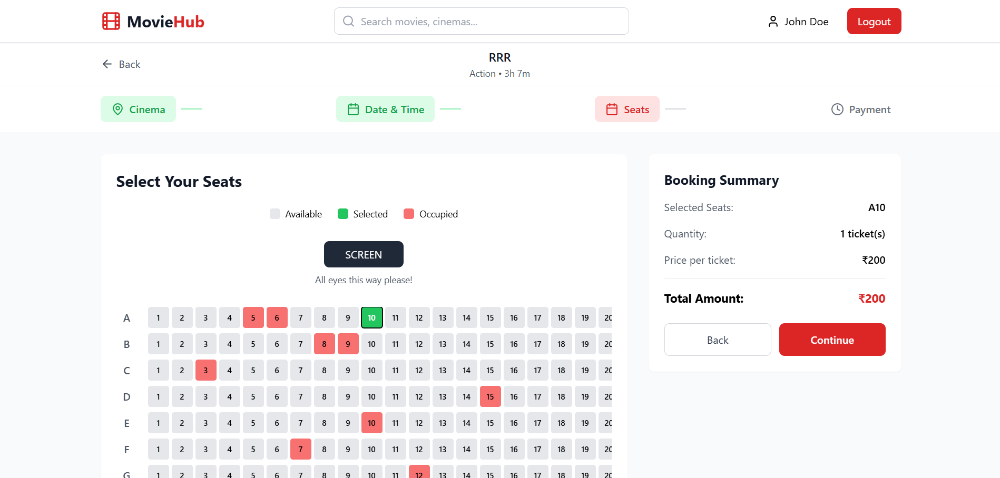
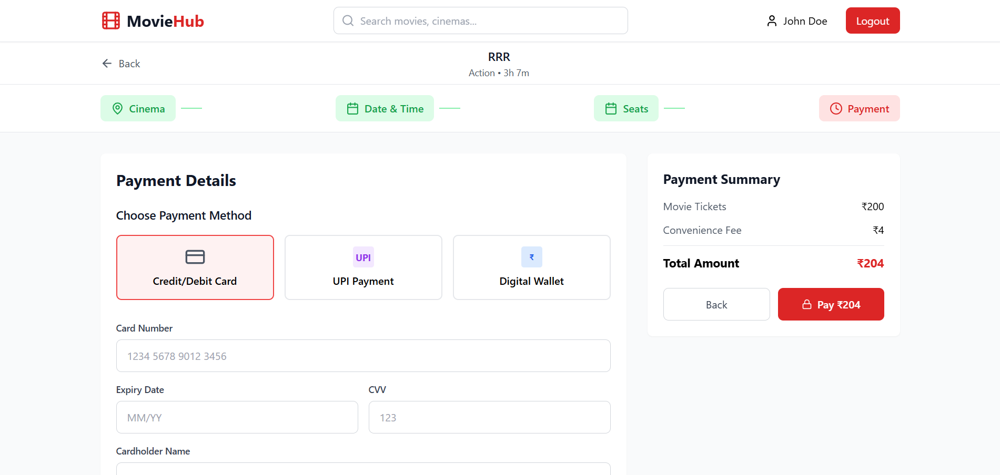

# 🎬 Movie Ticket Booking Website 

An interactive and user-friendly Movie Ticket Booking Platform built with **React, TypeScript, and Tailwind CSS**. This application provides a seamless movie booking experience, allowing users to explore movies, select seats, choose show timings, and complete bookings through a modern payment interface.

✨ Designed with a clean UI, responsive layout, and smooth user experience to simulate a real-world online movie ticket booking system.
## 🚀 Features

- 🎥 Browse Movies
- 🎟️ Seat Selection System
- 🕒 Show Timing Selection
- 💳 Payment Interface
- 📋 Booking Summary
- ✅ Booking Confirmation
- 📱 Responsive Design

## 🛠️ Tech Stack

- React.js
- TypeScript
- Tailwind CSS
- Vite
- Context API
- Lucide React Icons

## 📸 Screenshots

### 🏠 Home Page

### 🎟️ Seat Selection

### 💳 Payment Page

## 🔗 Project Links

**GitHub Repository:**  
https://github.com/vijaymp1214/movie-ticket-booking-website

## 👨‍💻 Author

**Vijay Prajapati**

GitHub Profile:  
https://github.com/vijaymp1214

---

⭐ If you like this project, please give it a star.
